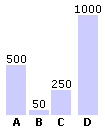

# DokuWiki Plugin: AVBarChart



Generates a very simple CSS/HTML bar chart. Supports colors.

## Install and documentation:

* https://www.dokuwiki.org/plugin:avbarchart
* Licence: GPL-2.0 (https://www.gnu.org/licenses/old-licenses/gpl-2.0.en.html)
* Author: Sherri W. (https://syntaxseed.com)

## Usage

### Format

```
<barchart>MAXVAL|Label1:#,Label2:#:Color,Label3:#</barchart>
```
### Examples

```
<barchart>100|A:55,B:5,C:23,D:38</barchart>
```

With Colored Bars:

```
<barchart>100|A:55:#ffcccc,B:5,C:23#00ff00,D:38</barchart>
```
