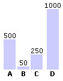

# DokuWiki Plugin: AVBarChart



Generates a very simple CSS/HTML bar chart. Supports colors.

## Install and documentation:

* https://www.dokuwiki.org/plugin:avbarchart
* Licence: GPL-2.0 (https://www.gnu.org/licenses/old-licenses/gpl-2.0.en.html)
* Author: Sherri W. (https://syntaxseed.com)

## Usage

### Format

```
<barchart>MAXVAL|Label1:#,Label2:#:Color,Label3:#</barchart>
```
### Examples

```
<barchart>100|A:55,B:5,C:23,D:38</barchart>
```

With Colored Bars:

```
<barchart>100|A:55:#ffcccc,B:5,C:23#00ff00,D:38</barchart>
```

# Changelog

* 2007-10-19
  * Created plugin.
* 2009-05-15
  * Added URL to zip for automatic installation.
* 2013-02-25
  * Updated layout bugs for latest browsers and version of Dokuwiki.
  * Updated this wiki page to remove redundant comments.
* 2020-02-07
  * Update for PHP v 7+.
  * Move to GitHub repo.
  * Add colored bars support. Contributed by ~ Gregor Anželj
* 2022-08-08
  * Test on 2022-07-31 “Igor”.
  * Test and fix for PHP 8.1.
* 2025-01-22
  * Fix deprecation notice.
* 2026-06-16
  * Fix input escaping bug. Issue #2.